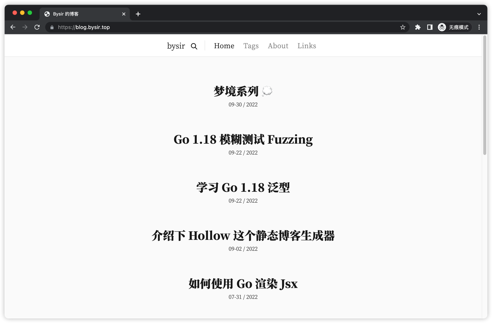
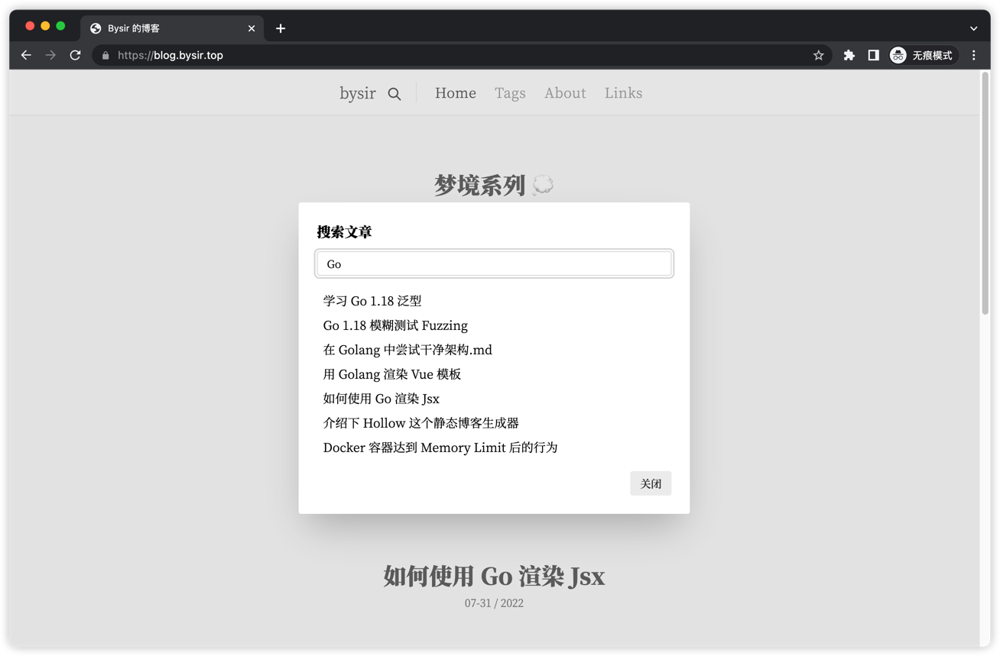
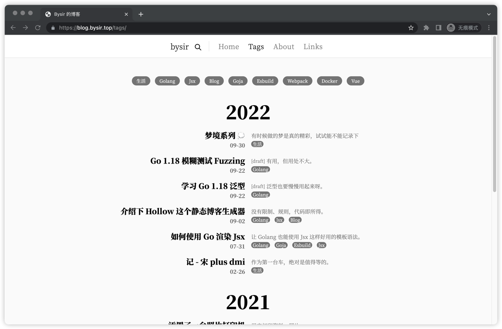
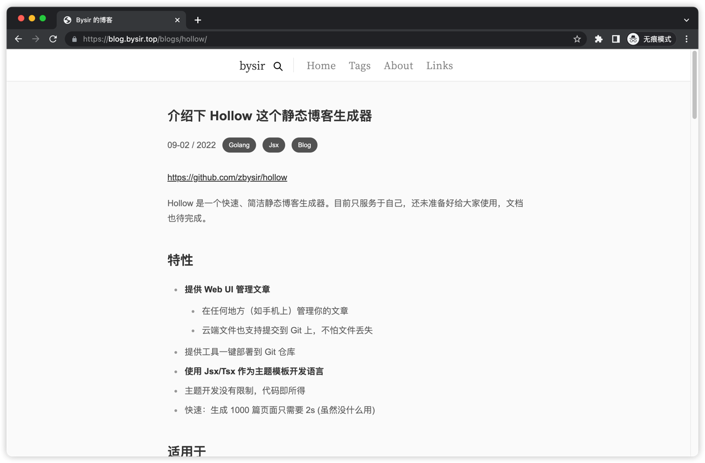

# Hollow Theme

Hollow 系统同名主题（也是第一款主题）。https://blog.bysir.top/

- 基于 tailwindcss + [daisyUI](https://github.com/saadeghi/daisyui)
- 支持自定义字体
- 支持搜索
- 支持 暗夜模式






## Params

支持配置以下参数：

```yaml
theme_config:
  title: Bysir 的博客
  logo: "bysir"
  font: 
    body:
      family: "LXGW WenKai" # 支持 LXGW WenKai / noto
  stack: Tailwindcss + <a href="https://github.com/zbysir/hollow">Hollow</a> + <a href="https://github.com/zbysir/gojsx">Jsx</a>
  footer_links:
    - url: https://github.com/zbysir
      name: GitHub
      icon: GitHub
  links_page: 'pages/links.md'
  about_page: 'pages/about.md'
```

## 代码结构
- index.tsx：网站页面代码生成入口，不参与编译（但同时也配置到了编译入口是因为需要使用到 watch 特性，当模板文件更改时也能生成 tailwindcss）
- main.css：生成 tailwindcss
- app/index.tsx：前端 js 代码编译入口，编译生成 app.js

## 预览主题
```bash
yarn preview
```

## 如何使用
修改项目下的 config.yml 文件:

```yaml
theme: https://github.com/zbysir/hollow-theme/tree/master/hollow
```

## 如何开发
- yarn
- yarn preview
